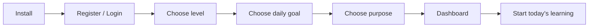
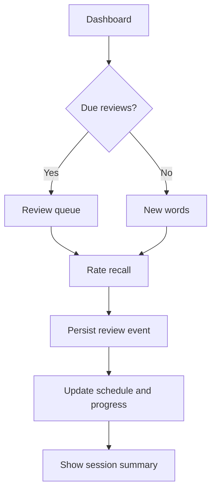
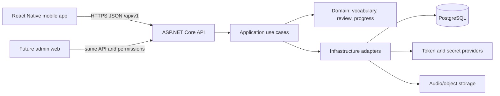
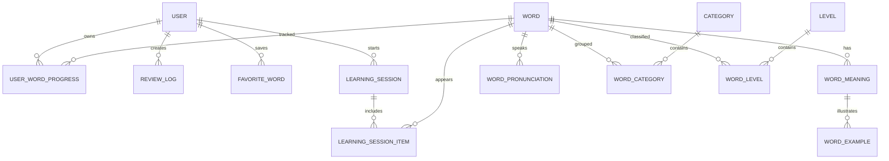

# English Vocabulary Learning Platform — Project Analysis

**Document status:** Initial baseline for an extensible MVP  
**Date:** 2026-09-26  
**Scope:** Mobile application first; admin web application is a planned phase, not part of the first delivery.

## 1. Executive summary

The product is a mobile-first English vocabulary learning platform. A learner selects a level and goal, studies words in short sessions, reviews due words with spaced repetition, and sees progress over time. Content is stored in PostgreSQL and delivered by an API; the mobile client must not contain the vocabulary catalog as hard-coded business data.

The first release should be a modular monolith with a focused learning loop:

1. Authenticate and complete a lightweight onboarding flow.
2. Select a CEFR level, daily goal, and learning purpose.
3. Browse and learn vocabulary through a flashcard flow.
4. Review due words using a server-authoritative spaced-repetition schedule.
5. Save favorites and inspect basic progress, streak, and statistics.

Placement tests, quizzes, push notifications, gamification, import tooling, and the admin panel are intentionally designed as extension points, but are not required to block the MVP.

## 2. Product vision and principles

### Vision

Make daily English vocabulary practice simple, measurable, and personalized for Turkish-speaking learners, while keeping the content and scheduling engine ready for future levels, exams, and an admin-managed catalog.

### Principles

- **Short daily loop:** the app should make the next useful action obvious.
- **Content is data:** words, meanings, examples, translations, and tags belong in the backend database.
- **Server-authoritative learning state:** review schedules and progress must be consistent across devices.
- **Progressive complexity:** start with a small set of reliable flows and add modes behind stable interfaces.
- **Accessible by default:** large touch targets, readable contrast, clear feedback, and screen-reader labels.
- **Observable and recoverable:** every important API operation is traceable without logging secrets or personal content unnecessarily.

## 3. Target users and initial personas

| Persona | Need | MVP implication |
| --- | --- | --- |
| Beginner learner | A1/A2 words, Turkish support, confidence | Simple definitions, examples, daily goal, no jargon |
| Exam-oriented learner | Structured progress and repeatable practice | Level/category filters and review statistics |
| Busy intermediate learner | Five-to-fifteen-minute sessions | Due-review queue and resume-able sessions |
| Content editor (future) | Manage catalog without app releases | Versioned content model and future admin API |

## 4. Scope boundaries

### MVP in scope

- Email/password registration and login.
- JWT access token plus rotating refresh token.
- Onboarding: target level, daily word/review goal, learning purpose, and optional Turkish UI preference.
- Dashboard: due reviews, today’s goal, streak, level, and recent progress.
- Vocabulary catalog served by API, filtered by level/category.
- Word detail: spelling, part of speech, meanings, Turkish translation, IPA/audio when available, examples, synonyms, and related words.
- Flashcard learning flow with self-rating.
- Due review flow powered by a replaceable spaced-repetition service.
- Favorites.
- Basic weekly and cumulative statistics.
- Profile and settings, including theme and notification preference placeholders.
- Online-first caching of catalog, word details, and the next review queue.
- PostgreSQL migrations and a repeatable content seed/import path for development.

### Explicitly deferred

- Admin web UI (the API and content model will prepare for it).
- Placement test and adaptive level recommendation.
- Multiple-choice, listening, spelling, and timed quiz modes.
- Push notification delivery and device-token management.
- Leaderboards, achievements, points, social features, subscriptions, and ads.
- Full offline-first authoring or a complete offline catalog.
- Machine-generated definitions/audio without a review and moderation workflow.

## 5. Proposed user journeys

### First run



### Daily learning loop



The mobile client may optimistically advance the card UI, but the schedule, streak, and aggregate progress are confirmed by the API. A failed review submission remains retryable and must not be silently discarded.

## 6. Recommended technology decisions

### Mobile

- React Native with TypeScript in an Expo-managed project.
- Use **Expo development builds**, not Expo Go, for production-oriented native modules and repeatable builds.
- Use React Navigation directly for the initial navigation tree; keep navigation isolated so Expo Router can be evaluated later without rewriting features.
- TanStack Query for server state, caching, invalidation, and retry behavior.
- Zustand for small client-only state such as theme, onboarding draft, and session UI state.
- `expo-secure-store` for refresh/access token material; never persist tokens in ordinary AsyncStorage.

Expo documents Expo Go as a limited playground and development builds as the path for production-grade apps. This makes an Expo development build a good default while retaining the option to generate native projects when needed.

### Styling decision: NativeWind/Tailwind

Use **NativeWind stable v4 with Tailwind CSS v3** for utility styling, plus a small design-token layer and reusable components. NativeWind maps Tailwind-like utilities to React Native styles; it is not browser CSS and should not be treated as a web-only stylesheet.

Recommended rules:

- Tailwind classes for layout, spacing, typography, colors, states, and common responsive variants.
- Centralized tokens for color, radius, spacing, typography, and light/dark themes.
- `StyleSheet` for highly dynamic values, animation calculations, and platform-specific native behavior.
- No Tailwind v5 RC in the MVP; revisit after the stable release and the dependency matrix is verified.
- Do not scatter arbitrary values throughout screens; add a token or component variant when a value repeats.

This gives fast, consistent UI iteration without locking the project to browser CSS. The design system remains portable if a future admin web app uses regular Tailwind CSS separately.

### Backend

- ASP.NET Core Web API on **.NET 10 LTS**.
- Entity Framework Core with the PostgreSQL provider (Npgsql).
- Clean modular boundaries: API, Application, Domain, Infrastructure, and tests.
- REST API versioned as `/api/v1`.
- OpenAPI/Swagger in development and a controlled non-production environment.
- FluentValidation or equivalent application-layer validation; problem-details responses at the API boundary.

As of the project baseline date, Microsoft lists .NET 10 as LTS through November 14, 2028, while .NET 9 is STS and reaches end of support on November 10, 2026. .NET 10 is therefore the default for a new project. The architect should re-check the installed SDK, Npgsql/EF Core compatibility, and hosting image before implementation; a confirmed infrastructure constraint may justify .NET 9 temporarily.

### Data and infrastructure

- PostgreSQL as the system of record.
- Docker Compose for local PostgreSQL and optional supporting services.
- Object storage/CDN for audio assets when audio moves beyond seed data.
- Structured logs and metrics through the chosen deployment platform; OpenTelemetry can be added when an environment is selected.
- CI should build the API and mobile TypeScript bundle, run lint/type checks, apply no production migrations automatically, and publish artifacts only from protected branches.

## 7. Architecture overview



The first backend deployment should be a modular monolith, not microservices. Vocabulary, review scheduling, progress, and authentication share transactional data and will evolve together. Modules can later be extracted only when load or ownership boundaries justify it.

## 8. Mobile application structure

```text
mobile/
  src/
    app/                  # navigation, providers, startup/bootstrap
    features/
      auth/
      onboarding/
      dashboard/
      vocabulary/
      learning/
      review/
      statistics/
      profile/
    components/           # Button, Card, EmptyState, WordRow, etc.
    design-system/         # tokens, theme, typography, NativeWind helpers
    lib/                   # api client, query client, secure storage
    state/                 # small client-only Zustand stores
    types/
  assets/
```

Each feature owns its screens, query hooks, local types, and presentation logic. Shared components must not contain feature-specific API calls. API models are mapped to view models so server changes do not leak into every screen.

### Initial navigation tree

```text
RootStack
├── AuthStack
│   ├── Login
│   └── Register
├── OnboardingStack
│   ├── Welcome
│   ├── LevelSelection
│   ├── DailyGoal
│   └── Purpose
└── MainTabs
    ├── Home
    ├── Learn
    ├── Review
    ├── Statistics
    └── Profile
```

Word detail, quiz, filters, and session summary should be modal or nested screens rather than top-level tabs.

## 9. Backend project structure

```text
src/
  EnglishLearning.Api/
    Endpoints/ or Controllers/
    Middleware/
    DependencyInjection/
  EnglishLearning.Application/
    Auth/
    Vocabulary/
    Learning/
    Review/
    Statistics/
    Common/
  EnglishLearning.Domain/
    Users/
    Vocabulary/
    Learning/
    Review/
    Common/
  EnglishLearning.Infrastructure/
    Persistence/
    Identity/
    Storage/
    Scheduling/
tests/
  EnglishLearning.UnitTests/
  EnglishLearning.IntegrationTests/
```

Use cases own transaction boundaries. The domain should not reference ASP.NET, EF Core, or PostgreSQL types. Infrastructure implements interfaces for token generation, audio storage, scheduling, clock, and external services.

## 10. Domain and database model

The model below is the smallest flexible core. It avoids creating every future concept as a table before there is a use case.

### Core entities

| Entity | Responsibility | MVP notes |
| --- | --- | --- |
| `User` | Identity and account state | Email, normalized email, password hash, status, timestamps |
| `RefreshToken` | Rotating session credentials | Store a hash, expiry, device metadata, revoked/replaced state |
| `UserSettings` | Preferences | Locale, theme, daily goal, notifications placeholder |
| `Level` | CEFR or custom level | A1–C2 seed data; extensible code and sort order |
| `Category` | Topic/exam/grouping | Daily, business, travel, IELTS, YDS, etc. |
| `Word` | Canonical spelling and pronunciation summary | Lowercase lookup key, display form, frequency/difficulty metadata |
| `WordMeaning` | Multiple senses | Part of speech, English definition, Turkish translation |
| `WordExample` | Usage examples | Belongs to a meaning; optional translation and audio |
| `WordPronunciation` | IPA and audio variants | Accent/language metadata; URL points to storage/CDN |
| `WordCategory` | Word/category many-to-many | Unique composite index |
| `WordLevel` | Word/level many-to-many | Supports a word appearing at multiple levels |
| `WordSet` | Curated or generated collection | Future admin-created sets |
| `WordSetItem` | Ordered membership | Unique set/word pair and optional position |
| `UserWordProgress` | Per-user schedule and mastery | One row per user/word |
| `ReviewLog` | Immutable review event | Idempotency key, rating, prior/next schedule snapshot |
| `LearningSession` | A study session | Start/end, mode, planned/completed counts |
| `LearningSessionItem` | Session membership | Word, source, result, order |
| `FavoriteWord` | User bookmark | Unique user/word pair |

### Relationships



### Identity and indexes

- Use application-generated UUIDs for public/domain IDs in the MVP; revisit UUIDv7 after the EF/Npgsql/runtime support matrix is verified.
- Normalize email and word lookup keys in the application and enforce unique database indexes.
- Use unique composite indexes for `WordCategory`, `WordLevel`, `WordSetItem`, `FavoriteWord`, and `UserWordProgress`.
- Use UTC timestamps (`timestamp with time zone` semantics) everywhere.
- Use soft deletion only for content that may be referenced by existing review logs; do not add `IsDeleted` to every table by default.
- Add `row_version`/concurrency handling where admin editing can later conflict with learner reads.

### Search

Start with normalized exact/prefix search and PostgreSQL `pg_trgm` indexes for English and Turkish search fields. Add full-text search only when phrase or definition search requirements justify its complexity.

## 11. Spaced repetition decision

Implement the scheduling engine behind an interface such as `IReviewScheduler` so the mobile app never knows the algorithm.

### MVP choice: FSRS-compatible model

Use an FSRS implementation or a carefully tested server-side port when the chosen package license and .NET compatibility are confirmed. Persist the minimum state needed to reproduce a decision:

```text
State: New | Learning | Review | Relearning | Mastered | Suspended
Stability
Difficulty
DueAt
LastReviewAt
Reps
Lapses
ElapsedDays
ScheduledDays
AlgorithmVersion
```

Store every rating in `ReviewLog` with the previous and next snapshots. This gives auditability and allows a future algorithm migration. If an acceptable FSRS dependency cannot be verified during implementation, use an SM-2 adapter behind the same interface rather than changing the API contract or mobile flow.

Ratings should be product language (`Again`, `Hard`, `Good`, `Easy`) and mapped to algorithm values only inside the backend.

## 12. API surface (initial)

All routes are under `/api/v1`; response errors use RFC 9457-style problem details with a stable `code`.

### Auth and account

```text
POST   /auth/register
POST   /auth/login
POST   /auth/refresh
POST   /auth/logout
GET    /me
PATCH  /me/settings
```

### Onboarding and dashboard

```text
GET    /onboarding/options
POST   /onboarding/complete
GET    /dashboard
GET    /statistics/summary
GET    /statistics/weekly
```

### Vocabulary

```text
GET    /levels
GET    /categories
GET    /words?level=A1&category=travel&search=...
GET    /words/{wordId}
GET    /favorites
PUT    /favorites/{wordId}
DELETE /favorites/{wordId}
```

### Learning and review

```text
POST   /sessions
GET    /sessions/{sessionId}
POST   /sessions/{sessionId}/items
GET    /review/queue?limit=20
POST   /review/events
```

`POST /review/events` must accept a client-generated idempotency key. Replaying the same event must return the original result rather than double-counting a review.

### Future admin boundary

Admin endpoints should be a separate authorization policy and route group, for example `/api/v1/admin/words`. Do not expose write access to the mobile user role. The first seed/import mechanism can be internal tooling or a protected deployment job until the admin UI exists.

## 13. Authentication, authorization, and security

- Short-lived access JWT (target 10–15 minutes) and rotating refresh tokens.
- Store only a hash of refresh tokens server-side; revoke the token family on reuse detection.
- Store client tokens in platform secure storage and clear them on logout or refresh failure.
- Password hashing with ASP.NET Core Identity-compatible strong hashing; never log credentials or raw tokens.
- Role/policy authorization for future admin roles; learner endpoints default to the current user.
- Validate request size, paging limits, search length, and enum values.
- Rate-limit login, registration, refresh, and review submission endpoints.
- Use HTTPS outside local development; keep secrets in environment/secret management, not repository files.
- Return generic login errors to reduce account enumeration.
- Add audit fields for content edits and security-sensitive account changes.
- Review third-party packages and audio/content licenses before shipping.

## 14. Offline and synchronization strategy

The MVP is **online-first with a useful cache**, not a full offline-first database.

- Cache levels, categories, word pages, dashboard data, and a bounded upcoming review queue with TanStack Query persistence.
- Allow a review card already loaded on the device to be completed offline.
- Queue review events locally with an idempotency key, client timestamp, and schema version.
- On reconnection, submit in order; the server remains authoritative for schedule and streak.
- If the same word was reviewed on two devices, process events by server receipt/order and return the resulting state; do not merge arbitrary client schedules.
- Show a clear “sync pending” state and preserve failed events for retry.
- Do not claim that the entire catalog is available offline until storage size, licensing, and migration requirements are measured.

## 15. Accessibility and UX requirements

- Minimum touch target around 44–48 dp where practical.
- Support dynamic font scaling without clipping the review controls.
- Contrast-compliant light and dark themes.
- Every icon-only action has an accessibility label and visible pressed/disabled state.
- Swipes are optional shortcuts; every critical action has a button alternative.
- Never rely on color alone for review result or mastery state.
- Announce card transitions and quiz feedback for screen readers.
- Localize all user-facing strings; do not concatenate sentence fragments.

## 16. Observability and error handling

### API

- Correlation/request ID returned in response headers and included in structured logs.
- Problem-details errors with safe user message, stable code, and validation details.
- Log event names and durations, not passwords, tokens, or full sensitive payloads.
- Track request latency, 4xx/5xx rate, review event failures, queue size, and refresh-token reuse alerts.

### Mobile

- Central API client maps network, authentication, validation, and unexpected errors.
- Query-level retry only for safe/transient requests; never blindly retry a mutation without idempotency.
- Error UI offers retry, offline continuation where supported, or sign-in recovery.
- Add crash reporting only after selecting a provider and configuring privacy/retention rules.

## 17. Performance considerations

- Cursor or bounded page pagination for words and review queues.
- Avoid returning full meanings/examples in list endpoints; use a summary DTO and a detail DTO.
- Cache stable catalog metadata with an explicit invalidation/version field.
- Batch dashboard counts or expose one dashboard read model to avoid request waterfalls.
- Add database indexes based on actual query plans, especially due date, user/word, normalized search, and category/level joins.
- Use image/audio lazy loading and CDN URLs when media is introduced.

## 18. Content strategy

The mobile app must not ship a hard-coded vocabulary catalog. Development content may be loaded through:

1. Versioned seed data for a minimal deterministic local environment.
2. An internal import command or protected endpoint that validates and upserts content.
3. A future admin workflow with draft/review/publish status.

Content should support provenance and review status before machine-generated or licensed material is added. Audio assets need source/license metadata and a fallback when unavailable.

## 19. Testing strategy

The implementation phase should add tests proportionate to risk:

- Domain unit tests for scheduling, state transitions, and goal/streak calculations.
- Application tests for authorization, idempotent review events, onboarding completion, and pagination.
- PostgreSQL-backed integration tests for migrations, unique constraints, and query behavior.
- Mobile component tests for navigation guards, loading/error/empty states, and review controls.
- End-to-end smoke path: register → onboarding → start session → submit review → dashboard update.
- Accessibility checks on core screens and both themes.

## 20. Delivery and environments

### Environments

- `local`: Docker PostgreSQL, development API, development build.
- `dev`: shared API/database with seeded content and protected test accounts.
- `staging`: production-like infrastructure and migration rehearsal.
- `production`: protected deployment with backups, alerts, and rollback procedure.

### Branch and release flow

- `dev` is the integration branch for application work.
- Short-lived feature branches merge into `dev` after review.
- `master` is the release/mainline branch and receives verified changes.
- Database migrations are reviewed artifacts; production migration execution is an explicit deployment step.

## 21. Incremental roadmap

### Phase 0 — foundation

- Create Expo mobile shell and .NET 10 solution.
- Configure formatting, linting, type checking, environment variables, Docker PostgreSQL, and CI skeleton.
- Add design tokens, NativeWind, navigation shell, API client, and health endpoint.

### Phase 1 — first learning loop

- Auth, onboarding, levels/categories, word catalog/detail, favorites.
- Learning session and review event API.
- FSRS-compatible scheduling adapter and basic dashboard.

### Phase 1.5 — monetization discovery and entitlement foundation

- Define Free/Premium feature matrix, package limits, ad placements, and trial strategy.
- Model Play Store/App Store product identifiers and server-authoritative entitlements.
- Build revenue scenarios for 1K/10K/50K/100K/500K active users, including store fees and adjustable assumptions.
- Validate current store policies, Türkiye tax/invoicing obligations, privacy consent, refunds, and subscription lifecycle handling before launch.

Detailed acceptance criteria and deliverables are tracked in [`docs/TASK_BACKLOG.md`](TASK_BACKLOG.md).

### Phase 2 — retention and quality

- Offline review queue, weekly statistics, streak accuracy, richer empty/error states.
- Audio playback, accessibility pass, crash/latency monitoring, and content validation tooling.

### Phase 3 — engagement

- Placement test, quiz modes, notifications, achievements, and more learning modes.

### Phase 4 — administration

- Admin web app, role-based content editing, import/export, moderation, publishing, and audit views.

## 22. Initial risks and mitigations

| Risk | Impact | Mitigation |
| --- | --- | --- |
| Overbuilding the content model | Slow MVP | Start with the core entities and add tables per use case |
| Incorrect scheduling behavior | User trust loss | Isolate algorithm, persist review logs, test deterministically |
| Offline conflicts | Double reviews or wrong streaks | Idempotency keys and server-authoritative ordering |
| Native dependency churn | Build failures | Expo development builds, pinned versions, CI build checks |
| Content licensing/quality | Legal and learning risk | Provenance, moderation status, import validation |
| Tailwind misuse in native UI | Inconsistent design | Tokens, shared components, NativeWind conventions |
| Premature microservices | Operational overhead | Modular monolith until measurable boundaries appear |
| .NET package mismatch | Build delay | Verify .NET 10 SDK, EF Core, Npgsql, and deployment image before coding |

## 23. Decisions to confirm before implementation

1. Product name and supported UI languages (Turkish only initially, or Turkish + English).
2. Registration method: email/password only, or social login in a later phase.
3. Initial seed vocabulary size and content licensing/source.
4. Audio source and whether audio is in the first release.
5. Hosting target and PostgreSQL backup requirements.
6. FSRS package/license approval; otherwise use the SM-2 adapter fallback.
7. Analytics/crash-reporting provider and privacy/consent requirements.
8. Whether `dev` is the default branch for day-to-day work and `master` is release-only.

## 24. Recommended MVP Architecture

```text
Mobile: React Native + TypeScript + Expo development build
Navigation: React Navigation
Styling: NativeWind v4 + Tailwind CSS v3 + design tokens
Server state: TanStack Query
Client state: Zustand
Secure credentials: expo-secure-store

Backend: ASP.NET Core Web API on .NET 10 LTS
Architecture: modular monolith with API/Application/Domain/Infrastructure
Persistence: EF Core + Npgsql + PostgreSQL
Auth: short-lived JWT access + rotating hashed refresh tokens
Scheduling: FSRS-compatible IReviewScheduler with ReviewLog audit trail
IDs: application-generated UUIDs for MVP
Offline: bounded cache + idempotent review queue, server authoritative
Delivery: Docker local environment, dev integration branch, protected master release branch
```

This baseline is ready for an architecture agent to turn into a repository scaffold and for an implementation agent to deliver the first vertical slice. It deliberately leaves placement testing, quizzes, notifications, gamification, and the admin UI behind stable boundaries rather than prematurely implementing them.

## 25. Reference links used for technology decisions

- [.NET support policy](https://dotnet.microsoft.com/en-us/platform/support/policy)
- [Expo workflow overview](https://docs.expo.dev/workflow/overview/)
- [Expo EAS workflows](https://docs.expo.dev/eas/workflows/get-started/)
- [NativeWind documentation](https://www.nativewind.dev/docs)
- [NativeWind installation](https://www.nativewind.dev/docs/getting-started/installation)
